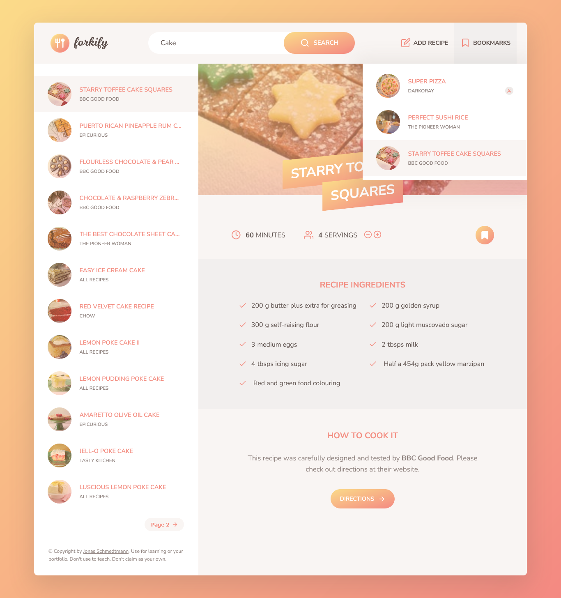

# 🗺️ Forkify App

This is a recipe search app built during the [**"The Complete JavaScript Course 2025: From Zero to Expert!"**](https://www.udemy.com/the-complete-javascript-course/?couponCode=C3GITHUB10) by **Jonas Schmedtmann**.

This app allows users to **search and bookmark recipes** from the **Forkify API**.

---

## 🚀 How to Use

1. **Go to this link →** [**Forkify**](https://darkoray.github.io/Forkify/).
2. **Search for a recipe** using the search bar at the top.
3. **Browse the results** to find a recipe you like.
4. **Click on a recipe** to view its details and instructions.
5. **Bookmark a recipe** by clicking the bookmark icon.

6. **View your bookmarks**:

   - Access them from the **bookmarks button** in the navigation bar.
   - **Click a bookmark** to view its details.

7. **How to Add Your Own Recipe**:

   - Click the **Add Recipe** button in the navigation bar.
   - Fill out the form with the recipe details:
     - **Title**: Enter the name of your recipe.
     - **URL**: Provide the source URL for the recipe.
     - **Image URL**: Add a link to an image of the dish.
     - **Publisher**: Specify the publisher's name.
     - **Prep time**: Enter the preparation time in minutes.
     - **Servings**: Specify the number of servings.
     - **Ingredients**: List ingredients in the format `quantity, unit, description` (e.g., `1, kg, flour`).
   - Click **Submit** to add the recipe to your collection.

---

## ✨ Features

- **Search for recipes** using keywords and ingredients
- **Get recipe details** including ingredients, instructions, and servings
- **Bookmark recipes** for later use
- **Upload your own recipes** with a user-friendly form
- **View all your bookmarks** in the bookmarks window

---

## 🛠️ Technologies Used

- **HTML5**
- **SCSS**
- **JavaScript (ES6+)**

  - Classes and OOP
  - Fetch API
  - Async/Await

- **Parcel** (for bundling and development server)

---

---

## 📄 License & Credits

This project is part of a course and provided for **learning purposes only**.

© by [Jonas Schmedtmann](https://twitter.com/jonasschmedtman).
You can use it for your portfolio or learning.
Don't use it to teach or redistribute as your own work.
